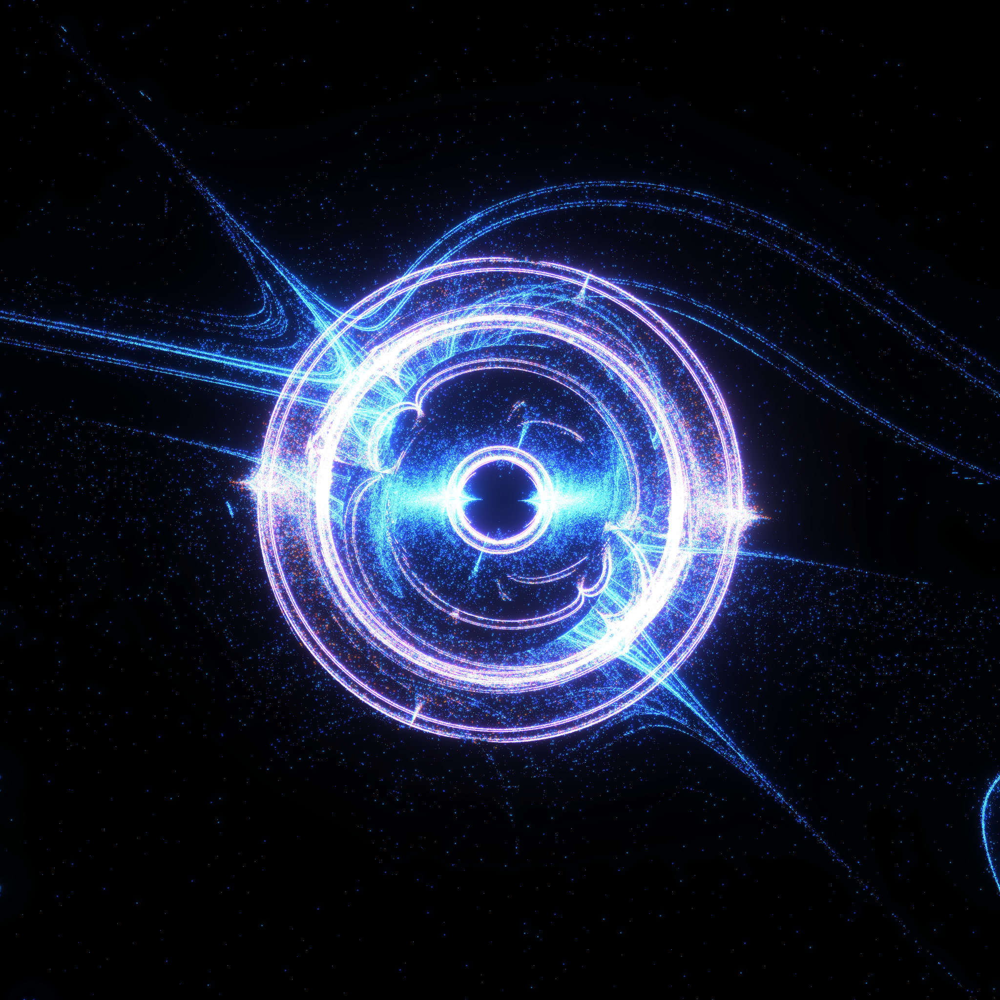
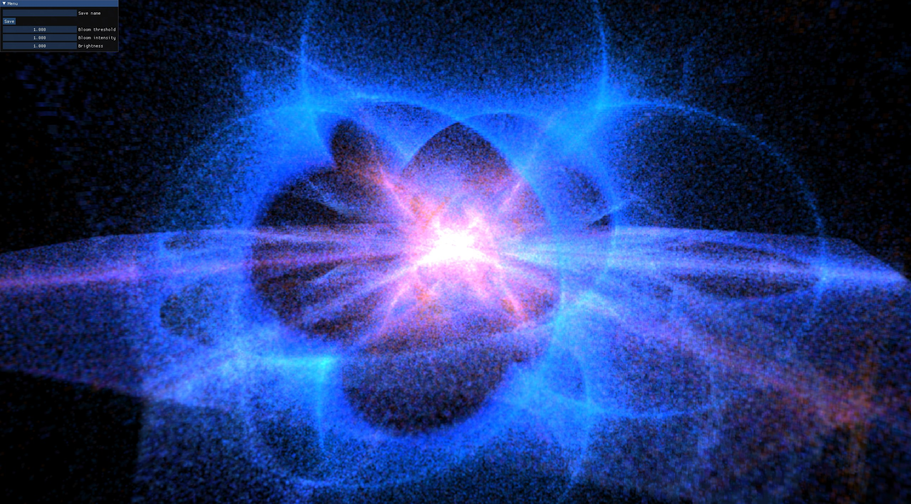

# IFS Generator

This is a 2D/3D IFS (iterated function system) fractal generator/viewer built with ORNG Engine, my hobby game engine.

### Current features

- GPU-powered programmable fractal generation
- Up to 8K image generation for 2D fractals
- 3D Volumetric rendering and exploration for 3D fractals (400^3 resolution)
- Basic tweakable post-processing (bloom, brightness)

### Usage

This is a project that can be opened in the ORNG Editor, a runtime distribution build also exists in this respository (build.zip -> ORNG_RUNTIME.exe) that can be opened and should just work.

To tweak fractal generation, the Ifs2D and Ifs3D shader files in res/shaders can be modified. These are already setup so can be easily tweaked with different functions, probabilities and colours.

As a warning, generating these is a heavy process and may cause some stuttering on your device. To reduce this, lower the iteration count in the IFS shaders.

To "load" a saved preset, overwrite the existing IFS files with the IFS files from that preset. Saved presets are stored in the configs folder.

### Results

